# Database Schema

## Overview

PostgreSQL is the canonical source of truth for all content. All public content is managed through the admin dashboard and served via the FastAPI backend.

## Entity Relationship Diagram

```mermaid
erDiagram
    admin_users {
        uuid id PK
        string username UK
        string email UK
        string hashed_password
        boolean is_active
        timestamp created_at
        timestamp updated_at
    }

    profiles {
        uuid id PK
        string full_name
        string title
        text bio
        string avatar_url
        string resume_url
        string location
        string email
        timestamp created_at
        timestamp updated_at
    }

    social_links {
        uuid id PK
        uuid profile_id FK
        string platform
        string url
        string icon
        int sort_order
        timestamp created_at
        timestamp updated_at
    }

    skills {
        uuid id PK
        string name
        string category
        string icon
        int proficiency_level
        boolean is_published
        int sort_order
        timestamp created_at
        timestamp updated_at
    }

    projects {
        uuid id PK
        string title
        string slug UK
        text description
        text summary
        text case_study
        string cover_image_url
        string live_url
        string github_url
        boolean is_published
        boolean featured
        int sort_order
        timestamp created_at
        timestamp updated_at
    }

    project_github_metadata {
        uuid id PK
        uuid project_id FK
        bigint github_id
        string name
        string full_name
        text description
        string url
        string homepage
        string language
        int stars
        int forks
        json topics
        timestamp last_pushed_at
        timestamp synced_at
        timestamp created_at
        timestamp updated_at
    }

    project_skills {
        uuid id PK
        uuid project_id FK
        uuid skill_id FK
    }

    experiences {
        uuid id PK
        string company
        string position
        string location
        date start_date
        date end_date
        text description
        boolean is_current
        boolean is_published
        int sort_order
        timestamp created_at
        timestamp updated_at
    }

    educations {
        uuid id PK
        string institution
        string degree
        string field_of_study
        date start_date
        date end_date
        text description
        boolean is_published
        int sort_order
        timestamp created_at
        timestamp updated_at
    }

    certificates {
        uuid id PK
        string name
        string issuer
        string credential_id
        string credential_url
        date issue_date
        date expiry_date
        string image_url
        boolean is_published
        int sort_order
        timestamp created_at
        timestamp updated_at
    }

    testimonials {
        uuid id PK
        string author_name
        string author_title
        string author_company
        string author_avatar_url
        text content
        int rating
        boolean is_published
        boolean featured
        int sort_order
        timestamp created_at
        timestamp updated_at
    }

    contact_messages {
        uuid id PK
        string name
        string email
        string subject
        text message
        string status
        timestamp created_at
        timestamp updated_at
    }

    analytics_events {
        uuid id PK
        string event_type
        string page_path
        string target_id
        string referrer
        string user_agent
        jsonb metadata
        timestamp created_at
    }

    seo_settings {
        uuid id PK
        string page_key UK
        string title
        string description
        string og_title
        string og_description
        string og_image_url
        string canonical_url
        jsonb structured_data
        timestamp created_at
        timestamp updated_at
    }

    profiles ||--o{ social_links : has
    projects ||--o| project_github_metadata : has
    projects ||--o{ project_skills : has
    skills ||--o{ project_skills : has
```



## Required Indexes

| Table | Column(s) | Purpose |
|-------|-----------|---------|
| `projects` | `slug` | Public URL lookups |
| `projects` | `is_published` | Published content filtering |
| `projects` | `featured` | Homepage featured projects |
| `skills` | `sort_order` | Display ordering |
| `experiences` | `sort_order` | Display ordering |
| `certificates` | `sort_order` | Display ordering |
| `analytics_events` | `event_type` | Event filtering |
| `analytics_events` | `created_at` | Time-based queries |
| `contact_messages` | `created_at` | Chronological listing |

## Contact Message Status Values

| Status | Description |
|--------|-------------|
| `unread` | New message, not yet seen |
| `read` | Message has been viewed |
| `archived` | Message has been archived |

## Migration Commands

```bash
# Generate a new migration
cd backend
alembic revision --autogenerate -m "description of change"

# Apply all pending migrations
alembic upgrade head

# Rollback one migration
alembic downgrade -1

# View current migration status
alembic current

# View migration history
alembic history
```
