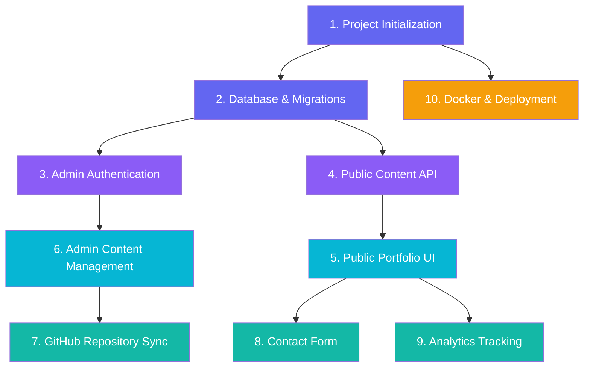

# Workflows

## Overview

This project is implemented in 10 sequential workflows. Each workflow has a clear goal, steps, and acceptance criteria. Complete one workflow at a time.

## Workflow Dependency Graph

## Workflow Index

| # | Workflow | Priority | Slash Command | File |
|---|---------|----------|---------------|------|
| 1 | Project Initialization | P1 | `/project-initialization` | [project-initialization.md](file:///d:/NOZYRA/My_Documents/Portofolio/portfolio%20antigravity/.agents/workflows/project-initialization.md) |
| 2 | Database & Migration Setup | P1 | `/database-and-migration-setup` | [database-and-migration-setup.md](file:///d:/NOZYRA/My_Documents/Portofolio/portfolio%20antigravity/.agents/workflows/database-and-migration-setup.md) |
| 3 | Admin Authentication | P1 | `/admin-authentication` | [admin-authentication.md](file:///d:/NOZYRA/My_Documents/Portofolio/portfolio%20antigravity/.agents/workflows/admin-authentication.md) |
| 4 | Canonical Public Content API | P1 | `/canonical-public-content-api` | [canonical-public-content-api.md](file:///d:/NOZYRA/My_Documents/Portofolio/portfolio%20antigravity/.agents/workflows/canonical-public-content-api.md) |
| 5 | Public Portfolio UI | P1 | `/public-portfolio-ui` | [public-portfolio-ui.md](file:///d:/NOZYRA/My_Documents/Portofolio/portfolio%20antigravity/.agents/workflows/public-portfolio-ui.md) |
| 6 | Admin Content Management | P2 | `/admin-content-management` | [admin-content-management.md](file:///d:/NOZYRA/My_Documents/Portofolio/portfolio%20antigravity/.agents/workflows/admin-content-management.md) |
| 7 | GitHub Repository Sync | P3 | `/github-repository-sync` | [github-repository-sync.md](file:///d:/NOZYRA/My_Documents/Portofolio/portfolio%20antigravity/.agents/workflows/github-repository-sync.md) |
| 8 | Contact Form | P2 | `/contact-form` | [contact-form.md](file:///d:/NOZYRA/My_Documents/Portofolio/portfolio%20antigravity/.agents/workflows/contact-form.md) |
| 9 | Analytics Tracking | P3 | `/analytics-tracking` | [analytics-tracking.md](file:///d:/NOZYRA/My_Documents/Portofolio/portfolio%20antigravity/.agents/workflows/analytics-tracking.md) |
| 10 | Docker & Deployment | P1–P4 | `/docker-and-deployment` | [docker-and-deployment.md](file:///d:/NOZYRA/My_Documents/Portofolio/portfolio%20antigravity/.agents/workflows/docker-and-deployment.md) |

## Suggested Implementation Order

### Phase 1 — Foundation (P1)
1. Project Initialization → Docker Compose skeleton
2. Database & Migrations → All tables and seed data
3. Admin Authentication → Login/logout/route protection
4. Public Content API → All public endpoints
5. Public Portfolio UI → Award-winning homepage

### Phase 2 — Content (P2)
6. Admin Content Management → Full CRUD dashboard
8. Contact Form → Public form + admin inbox

### Phase 3 — Intelligence (P3)
9. Analytics Tracking → Event tracking + admin summary
7. GitHub Repository Sync → Repo import + admin curation

### Phase 4 — Polish (P4)
10. Docker & Deployment → Production-ready config
- Advanced motion effects
- SEO polish, Open Graph images
- Sitemap, robots.txt
- Nginx production config
